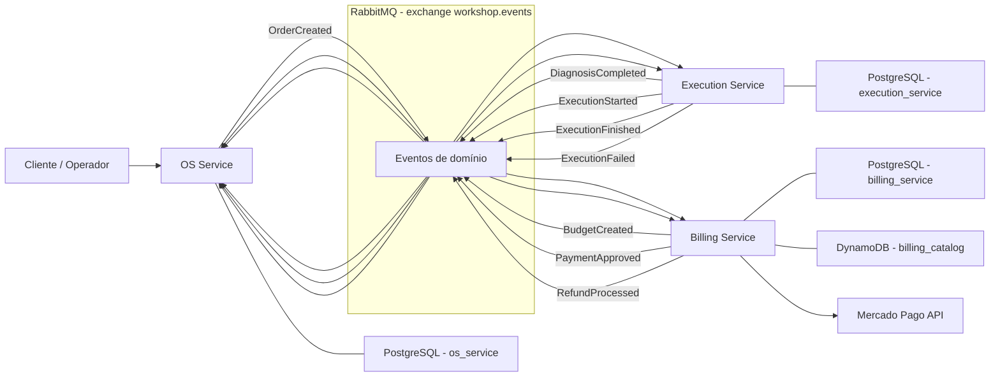
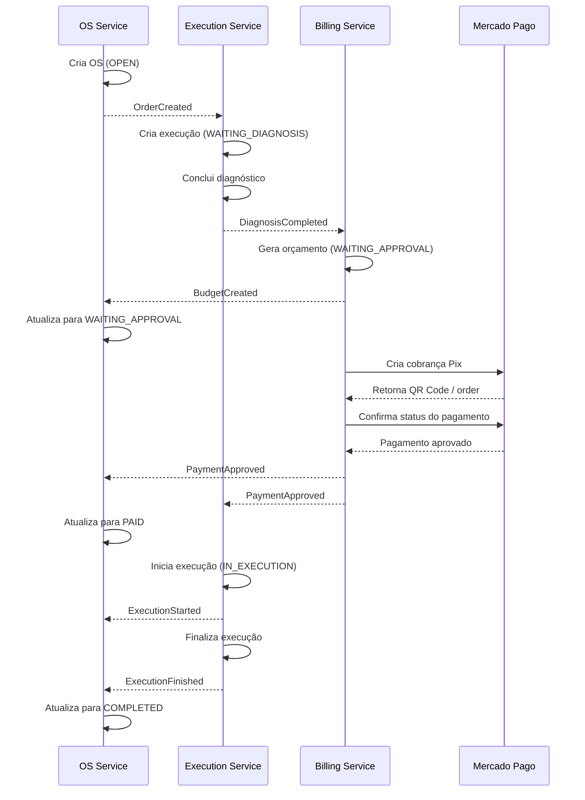
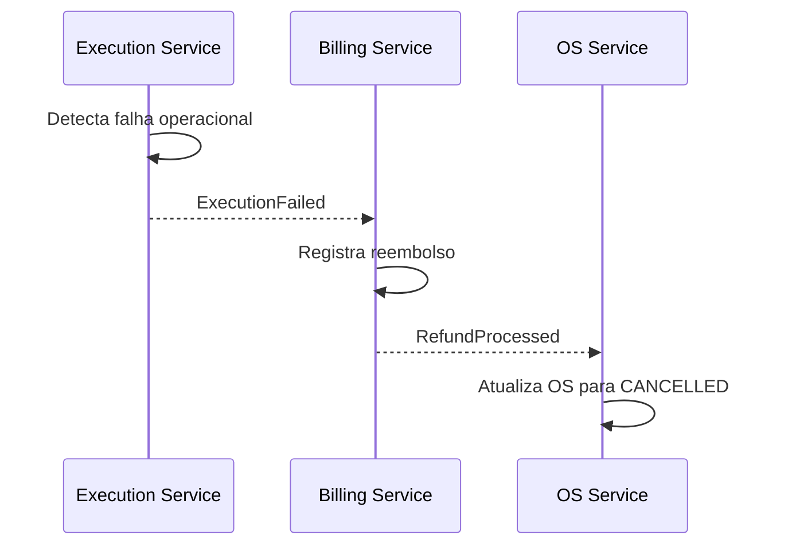

# Fase 4 - Arquitetura Geral da Solução

Este documento consolida a visão geral da refatoração da aplicação para uma
arquitetura de microsserviços, cobrindo responsabilidades de cada serviço,
estratégia de comunicação, uso de bancos de dados, padrão Saga, compensações,
observabilidade e artefatos entregues.

## Visão Geral

A solução foi dividida em três microsserviços independentes:

- `OS Service`: ciclo de vida da ordem de serviço;
- `Execution Service`: diagnóstico, fila operacional e execução do reparo;
- `Billing Service`: orçamento, pagamento e reembolso.

Cada microsserviço possui:

- repositório próprio;
- banco de dados próprio;
- Dockerfile;
- manifestos Kubernetes;
- pipeline de CI/CD independente;
- suíte de testes própria;
- documentação e Swagger próprios.

## Arquitetura dos Microsserviços

## Responsabilidade de Cada Serviço

### OS Service

Responsável por:

- abrir ordens de serviço;
- manter cliente, veículo, descrição do problema e histórico da OS;
- refletir o status global da OS a partir dos eventos recebidos;
- manter a trilha de auditoria de mudança de status.

Principais eventos publicados:

- `OrderCreated`

Principais eventos consumidos:

- `BudgetCreated`
- `PaymentApproved`
- `ExecutionStarted`
- `ExecutionFinished`
- `RefundProcessed`

### Execution Service

Responsável por:

- receber a OS recém-aberta para diagnóstico;
- registrar serviços e peças identificados;
- iniciar a execução após pagamento;
- concluir ou falhar a execução;
- publicar eventos operacionais para os demais serviços.

Principais eventos publicados:

- `DiagnosisCompleted`
- `ExecutionStarted`
- `ExecutionFinished`
- `ExecutionFailed`

Principais eventos consumidos:

- `OrderCreated`
- `PaymentApproved`

### Billing Service

Responsável por:

- manter o catálogo de serviços e peças;
- gerar orçamento a partir do diagnóstico;
- iniciar cobrança Pix no Mercado Pago;
- confirmar pagamento;
- executar compensação financeira via reembolso;
- publicar eventos financeiros e comerciais.

Principais eventos publicados:

- `BudgetCreated`
- `PaymentApproved`
- `RefundProcessed`

Principais eventos consumidos:

- `DiagnosisCompleted`
- `ExecutionFailed`

## Bancos de Dados

O requisito de bancos independentes por serviço foi atendido da seguinte forma:

| Serviço | Banco relacional | Banco não relacional | Finalidade |
|---|---|---|---|
| OS Service | PostgreSQL | - | ordens, clientes, veículos, histórico, outbox |
| Execution Service | PostgreSQL | - | diagnósticos, execução, histórico, outbox |
| Billing Service | PostgreSQL | DynamoDB | orçamento, pagamentos, reembolsos, outbox / catálogo |

Observações importantes:

- nenhum serviço acessa diretamente o banco de outro serviço;
- o catálogo foi isolado no `Billing Service` em DynamoDB;
- a consistência entre serviços acontece por eventos e contratos de mensagem.

## Estratégia de Comunicação

### Comunicação assíncrona

A integração principal entre microsserviços é feita por RabbitMQ, usando o
exchange `workshop.events`.

Padrões aplicados:

- outbox transacional para publicação confiável;
- filas por contexto consumidor;
- eventos de domínio desacoplados;
- controle de idempotência com `processed_events`.

### Comunicação síncrona

A comunicação síncrona é usada quando faz sentido operacionalmente:

- APIs HTTP expostas por cada microsserviço;
- documentação Swagger/OpenAPI;
- integração HTTP com o Mercado Pago no `Billing Service`;
- endpoints internos de apoio para testes e diagnóstico local.

## Saga Pattern

### Padrão escolhido

Foi adotado o padrão **Saga Coreografada**.

Justificativa:

- não há um orquestrador central;
- cada serviço reage a eventos de domínio do passo anterior;
- o fluxo fica desacoplado e aderente ao modelo de microsserviços;
- a responsabilidade de evolução de estado permanece no serviço dono do contexto.

### Fluxo principal da saga

### Fluxo de compensação

### Como a compensação foi implementada

- a falha operacional é publicada como `ExecutionFailed`;
- o `Billing Service` consome o evento e registra o reembolso;
- após registrar a compensação, o `Billing Service` publica `RefundProcessed`;
- o `OS Service` consome `RefundProcessed` e reflete o estado final da OS.

Esse modelo evita transações distribuídas de banco e mantém consistência
eventual por meio de eventos idempotentes.

## Observabilidade

Foi reaproveitada e expandida a base de observabilidade da Fase 3.

Recursos adotados:

- Datadog APM;
- tracing distribuído com `ddtrace`;
- logs estruturados em JSON;
- correlação por `correlation_id`;
- spans para API HTTP, RabbitMQ publish/consume e queries SQL;
- nomes dedicados para API, publisher, consumer e banco.

Exemplos de serviços visualizados no Datadog:

- `os-service`
- `os-service-publisher`
- `os-service-consumer`
- `os-service-db`
- `execution-service`
- `execution-service-publisher`
- `execution-service-consumer`
- `execution-service-db`
- `billing-service`
- `billing-service-publisher`
- `billing-service-consumer`
- `billing-service-db`

## Qualidade, Testes e CI/CD

Cada microsserviço possui pipeline independente em:

- `.github/workflows/ci-cd.yml`

O pipeline contempla:

- build;
- execução de testes automatizados;
- validação de qualidade via SonarQube/SonarCloud;
- build de imagem;
- deploy automatizado em Kubernetes.

Requisitos já cobertos na solução:

- testes unitários em todos os microsserviços;
- BDD com Gherkin no `Billing Service`;
- cobertura mínima de 80% por serviço;
- quality gate no CI;
- branch protection na `main`.

## Deploy e Execução

Execução local:

- cada serviço sobe exclusivamente via Docker Compose;
- RabbitMQ é usado como broker local e também como padrão arquitetural para nuvem;
- o `Billing Service` sobe também um DynamoDB Local para desenvolvimento.

Deploy:

- manifestos Kubernetes por repositório;
- integração com EKS;
- pipeline automatizada para publicação e deploy.

## Repositórios da Solução

- `pos-fiap-os-service`
- `pos-fiap-execution-service`
- `pos-fiap-billing-service`

Cada repositório contém:

- código-fonte;
- Dockerfile;
- manifestos Kubernetes;
- pipeline CI/CD;
- testes;
- Swagger/OpenAPI;
- README do serviço.

## Onde Encontrar os Detalhes

- visão específica do `OS Service`: [../README.md](../README.md)
- visão específica do `Execution Service`: [../../pos-fiap-execution-service/README.md](../../pos-fiap-execution-service/README.md)
- visão específica do `Billing Service`: [../../pos-fiap-billing-service/README.md](../../pos-fiap-billing-service/README.md)
